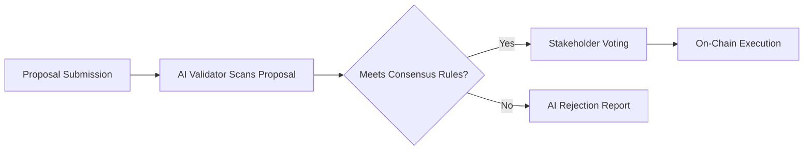

# Quantura Network

**Quantura** is a secure, intelligent, and evolving Layer 1 blockchain protocol designed with built-in resistance to quantum computing threats and native AI capabilities.

---

## ⚙️ Core Architecture

```mermaid
graph TD
    User[End User / DApp] -->|Tx| SmartContract
    SmartContract -->|Executes| VM[EVM-Compatible VM]
    VM --> PQC[Post-Quantum Crypto Module]
    VM --> AIEngine[AI Execution Layer]
    AIEngine --> GovernanceDAO[AI-Powered Governance]
    PQC --> ValidatorNode
    ValidatorNode --> ConsensusEngine
    ConsensusEngine --> BlockchainStorage[(Post-Quantum Ledger)]
````

---

## 🔁 Consensus Flow

```mermaid
sequenceDiagram
    participant Validator as Validator Node
    participant PQ as PQ Crypto Module
    participant Block as Block Producer
    participant Chain as Blockchain State

    Validator->>PQ: Sign Transaction (Dilithium)
    PQ-->>Validator: Quantum-safe Signature
    Validator->>Block: Propose Block
    Block->>Validator: Validate Block
    Validator->>Chain: Commit Block to Chain
```

---

## 🧠 AI Governance Layer



---

## 🔧 Project Structure

```bash
quantura-network/
├── consensus/          # Core consensus logic
├── pqcrypto/           # Lattice-based cryptographic primitives
├── ai-layer/           # On-chain AI verification engine
├── contracts/          # Smart contracts (Solidity / Cairo)
├── governance/         # DAO and proposal modules
├── sdk/                # Dev tooling, CLI, API bindings
└── docs/               # Documentation
```

---

## 🧪 Tech Stack

* Rust (core)
* Solidity (EVM support)
* zk-SNARKs
* Kyber / Dilithium (post-quantum)
* AI model runtime (Wasm or ZK-ML)
* DAO + AI Agents

---

## 🌐 Network Roadmap

| Phase   | Milestone                         | Target Date |
| ------- | --------------------------------- | ----------- |
| Phase 1 | Testnet v1 w/ EVM Support         | Q2 2025     |
| Phase 2 | Mainnet Genesis                   | Q3 2025     |
| Phase 3 | Quantum & AI Integration          | Q4 2025     |
| Phase 4 | AI-Native Governance & PQ Bridges | 2026        |

---

## 📡 Community

* Website: [quantura.network](https://quantura.network)
* Twitter: [x.com/quanturanetwork](https://x.com/quanturanetwork)
* Telegram: [t.me/quanturanetwork](https://t.me/quanturanetwork)

---

## 🪪 License

MIT License — open-source, security-focused, future-ready.

---

**Quantura** is the first post-quantum blockchain with AI-native intelligence and self-evolving consensus logic.
